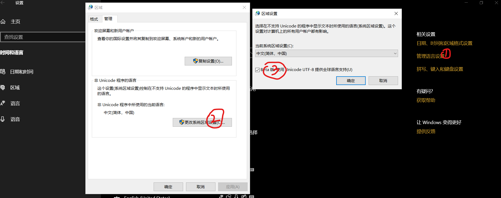
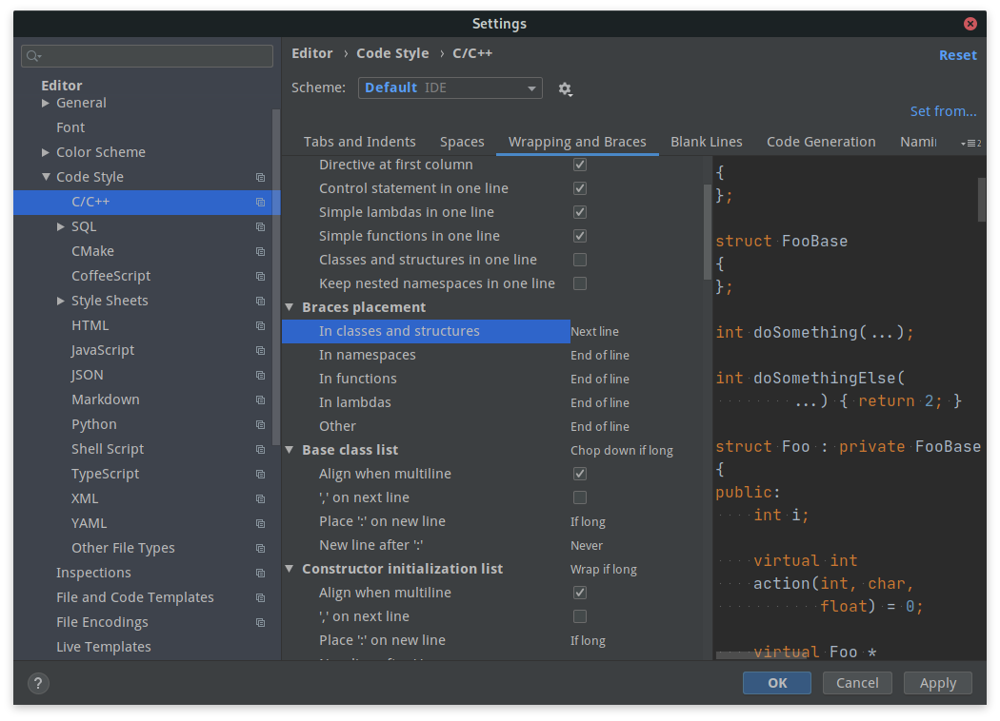

# 2019

## 12.06
&emsp;&emsp;Manjaro输入法的问题，网上过时的教程是在根目录下建`.xprofile`文件，里面加上
```shell
export GTK_IM_MODULE=fcitx
export QT_IM_MODULE=fcitx
export XMODIFIERS="@im=fcitx"
```
&emsp;&emsp;发现不管用，找到管用的办法是在`/etc/environment`写入这三行。
&emsp;&emsp;linux环境变量可以简单的分成用户自定义的环境变量以及系统级别的环境变量。
&emsp;&emsp;用户级别环境变量定义文件：`~/.bashrc`、`~/.profile`（部分系统为：`~/.bash_profile`）
&emsp;&emsp;系统级别环境变量定义文件：`/etc/bashrc`、`/etc/profile`(部分系统为：`/etc/bash_profile`）、`/etc/environment`
&emsp;&emsp;另外在用户环境变量中，系统会首先读取`~/.bash_profile`（或者`~/.profile`）文件，如果没有该文件则读取`~/.bash_login`，根据这些文件中内容再去读取`~/.bashrc`。

***

&emsp;&emsp;Manjaro启动v2ray用`systemctl start v2ray`命令。

&emsp;&emsp;linux下装好Chrome后无法用crx文件安装SwitchyOmega，应用商店又打不开，陷入死循环。找到办法，打开系统代理，使用手动配置的代理服务器，socks代理`127.0.0.1`，端口一般填`1080`（我用了`2333`），这样v2ray就变成全局的了，就可以先去应用商店装好插件再把全局代理关掉。
&emsp;&emsp;在线恢复备份https://raw.githubusercontent.com/wiki/FelisCatus/SwitchyOmega/GFWList.bak
&emsp;&emsp;规则列表网址https://raw.githubusercontent.com/gfwlist/gfwlist/master/gfwlist.txt

***

&emsp;&emsp;双系统Manjaro时间和win10不一致，让Manjaro使用本地时间
```shell
sudo timedatectl set-local-rtc true
```

***

&emsp;&emsp;字体格式总是忘记装哪个好，记一下，TTF进化成了OTF。

## 12.15
&emsp;&emsp;github提交代码步骤在这里记一下
```shell
git status
git add -A
git commit -m "message"
git push origin master
```

# 2020

## 02.03
&emsp;&emsp;Windows下CLion中文乱码最有效的解决方式不是去Clion设置里面改，而是修改Windows操作系统的默认字符集。

&emsp;&emsp;乱码的原因，g++在编译时默认输入编码和输出编码都是UTF-8，而Windows操作系统默认字符集是GBK。

## 02.13
&emsp;&emsp;Clion按`Ctrl+Alt+L`自动格式化代码，左大括号默认不会换行，改成换行在 Settings->Editor->Code Style 。选择相应的语言以及 ‘Wrapping and braces’ tab。展开 'Braces placement options' ，修改成 'Next line' 即可。


## 08.31
&emsp;&emsp;遇到了个pcl 1.10.0-1的依赖库qhull报错的问题，去google只找到一个和我遇到同样问题的帖子，一个多月也没人回答，只好自己折腾。
&emsp;&emsp;发现它同时需要`/usr/lib/`下的`libqhull_p.so.8.0`和`libqhull_p.so.7`，然而只能装一个版本。

解决方案：
安装`qhull-2019.1-4-x86_64.pkg.tar.zst`
备份`usr/lib`下的`libqhull_p.so.7`和`libqhull_p.so.7.3.2`
升级安装`qhull 2020.1-1`
把`libqhull_p.so.7`和`libqhull_p.so.7.3.2`移回去

## 10.06
`x & (-x);`是保留位中最右边1 ，且将其余的1设为0的方法。
## 10.07
&emsp;&emsp;之前不太熟的Linux Shell命令：
```shell
pwd      #print working directory 输出当前目录的完整路径
touch 文件名    #创建空白文件
rm -r 文件夹名   #递归删除目录下的所有文件
cat 文件名      #输出文件所有内容
head -n 5 a.txt     #输出a.txt头5行
tail -n 5 a.txt     #输出a.txt后5行
grep 'a' 文件名      #显示文件中所有包含'a'文字的行

#Pipe/Redirection   管道/重定向     将一个命令的输出作为另一个命令的输入
ls | head -n 3
ls | grep 'a'
ls | sort

```
## 12.07
&emsp;&emsp;`git clone`的时候，将`github.com`换为`github.com.cnpmjs.org`即可实现加速，这个网址是可以浏览的
## 
## 
## 
## 
