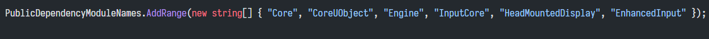
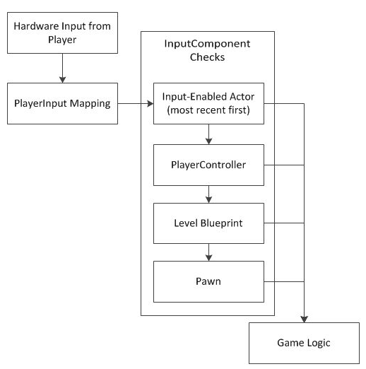
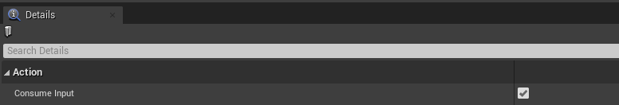
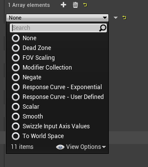
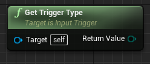
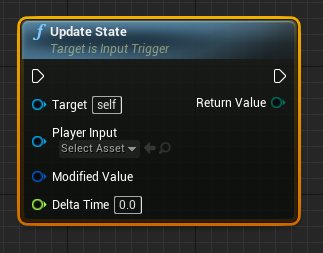
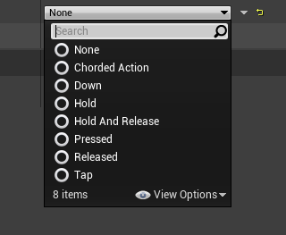
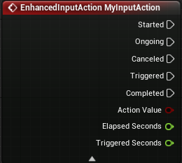

# 启用

打开官方文档

https://docs.unrealengine.com/5.0/zh-CN/GameplayFeatures/EnhancedInput/

按照指南做这两步操作

1. 启用 Enhanced Input 插件
2. 在项目设置里修改两个输入类

如果要在 C++ 代码里使用 Enhanced Input，还有一个补充步骤：在 *项目名.build.cs* 文件里添加 "EnhancedInput"

# 复习默认的输入

我们先复习一下默认的输入逻辑，方便待会和增强输入的比较。

1. **玩家的硬件输入（Hardware Input from Player）：**

   比如长按 W，按下 空格

2. **玩家输入映射（PlayerInput Mapping）：**

   操作映射（ActionMappings）将**离散**按键 空格 映射到 Input Action "Jump"

   轴映射（AxisMapping）**持续**轮询，将W转换为比例为1的 Input Axis "MoveForward"。

3. **InputComponent优先级堆栈（InputComponent Priority Stack）：**

   检查 InputComponent 优先级堆栈，如果栈上方的 InputComponent 绑定了这个输入对应的回调函数，就执行。否则，将信号向栈的下方传递。

4. **游戏逻辑（Game Logic）：**

   执行回调函数里的游戏逻辑。

   

# 简述

增强输入有四个核心理念，**输入操作（Input Action）(EnhancedInputAction)**，**输入映射上下文（Input Mapping Contexts）**，**输入修饰符（Input Modifier）**，**输入触发器（Input Trigger）**。

下面是默认输入和增强输入最主要的几个区别，有一些新概念。

|                            | 默认输入                                                     | 增强输入                                                     |
| -------------------------- | ------------------------------------------------------------ | ------------------------------------------------------------ |
| 在哪里绑定硬件输入与操作？ | 在 Project Settings -> Input -> Bindings -> Action/Axis Mappings 里配置硬件输入与 Input Action/Axis 的绑定 | Input Mapping Contexts 和 (Enhanced) Input Action 都是资产，在 Input Mapping Contexts 资产里配置硬件输入与 (Enhanced) Input Action 绑定。 |
| 怎样区分离散和连续的操作？ | 用 Input Action / Input Axis 区分                            | 统一用 (Enhanced) Input Action，然后使用不同的 Trigger (或者 Trigger event)来区分 |
| 输入的优先级是怎么实现的？ | 检查 InputComponent 优先级堆栈，找到了绑定就响应，否则信号向栈的下方传递 | 可以有多个 Input Mapping Contexts 资产，添加它们到 Enhanced Input Local Player Subsystem 时可以设置不同的优先级 |
| 操作返回的值怎样修饰？     | Axis Mapping 里可以改 Scale，还有 Axis Config 里也有一些硬件输入可以配置 | 配置 (Enhanced) Input Action 的 Modifier 来修饰它的返回值，可以在 Input Mapping Contexts 资产里或者在 Action 资产里配置 |
| 操作和游戏逻辑怎样连接？   | InputAxis 可以传值，InputAction 则有 Pressed 和 Released     | EnhancedInputAction 的多种 Trigger event 与游戏逻辑连接      |

# 输入操作

这一节看官方文档的介绍。

## 补充

在自己创建的 EnhancedInputAction 资产里，有一个 Consume Input，可以选择是把输入消耗掉还是继续传给更低优先级的 Action

# 输入映射上下文

这一节看官方文档的介绍。

# 输入修饰符

输入修饰符会修改UE5收到的原始输入值，然后再发送给输入触发器。

| 插件提供的修饰符              | 说明                                                         | 备注                                                         |
| ----------------------------- | ------------------------------------------------------------ | ------------------------------------------------------------ |
| None                          |                                                              |                                                              |
| Dead Zone                     | 死区。将 LowerThreshold -> UpperThreshold 的输入映射到 0 -> 1，在阈值外的输入值会被映射到 0 或 1 | Type 默认是 Radial，输入计算时用了向量的模长，会更平滑。可以改成 Axial，Axial 是将 X, Y, Z 当做独立的分别映射，和原来的死区逻辑一样。 |
| FOV Scaling                   | 对每个轴的输入值应用与 FOV 相关的缩放比例                    | Type 默认是 Standard。还有一个 UE4_BackCompat 是为了兼容，其实计算是不正确的。 |
| Modifier Collection           | 修饰符集合。可以将多个修饰符结合起来                         | 可以设置 Permit Value Type Modification，即是否允许转换 ValueType |
| Negate                        | 负。将输入取反                                               | 可以对 X, Y, Z 分别设置是否要取反                            |
| Response Curve - Exponential  | 响应曲线 - 指数。给定指数，对输入值求幂                      | 可以对 X, Y, Z 分别设置不同的指数                            |
| Response Curve - User Defined | 响应曲线 - 用户定义。对输入值应用用户指定的响应曲线          | 可以对 X, Y, Z 分别设置不同的响应曲线                        |
| Scalar                        | 标量。将输入乘以系数                                         | 可以对 X, Y, Z 分别设置不同的缩放比例。不支持 bool 值        |
| Smooth                        | 平滑。在多个帧上平滑输入                                     | 这个修饰符目前还不能用，还没写完。                           |
| Swizzle Input Axis Values     | 将输入值的坐标轴交换                                         | 有 5 种 Order 可选，默认将 XYZ 交换到 YXZ，还可以改成 ZYX, XZY, YZX, ZXY |
| To World Space                | 将输入值从输入空间转换到世界空间                             | 这样就可以将结果直接插入接受世界空间值的函数中。bool 和 1D 值不会处理，2D 值交换 X, Y，3D 值变成 (Z, X, Y) |

# 输入触发器

输入触发器确定用户输入（在经历过输入修饰符的处理）之后是否应该在其输入映射上下文中激活相应的输入操作。（如果没有使用输入触发器，默认就是按下触发）

Triggers 可以在 Input Action 里配置，也可以在 Input Mapping Context 里配置，这两个地方不是同步的，而是会都生效。

官方文档的例子是在 Input Mapping Context 里配置的。

## 触发器类型

（如果只使用插件提供的触发器的话，这一节不用看）

输入触发器有三种类型（**ETriggerType**），C++ 里可以通过函数`GetTriggerType_Implementation()`获得。

在蓝图中可以用 Get Trigger Type 

| ETriggerType | 值   | 说明                                                         | 备注                                                     |
| ------------ | ---- | ------------------------------------------------------------ | -------------------------------------------------------- |
| Explicit     | 0    | **显式**。如果输入触发器成功，该类型将使输入成功。           | 自带的大部分触发器都是这个类型                           |
| Implicit     | 1    | **隐式**。如果输入触发器和所有其他隐式类型输入触发器成功，该类型将使输入成功。 | 自带的只有 Chorded Action 是这个类型                     |
| Blocker      | 2    | **拦截器**。如果输入触发器成功，该类型将使输入失败。         | 自带的只有 UInputTriggerChordBlocker是这个类型，但没公开 |

## 触发器状态

（如果只使用插件提供的触发器的话，只看下面的表格就够了）

在处理用户输入后，输入触发器会通过`UpdateState`函数返回以下三种触发器状态（Trigger State）（**ETriggerState**）之一

| ETriggerState | 值   | 说明                                                         | 备注                                                         |
| ------------- | ---- | :----------------------------------------------------------- | ------------------------------------------------------------ |
| None          | 0    | **无**。表示输入触发器的条件尚未满足，输入触发器失败。       |                                                              |
| Ongoing       | 1    | **进行中**。表示输入触发器的条件部分满足，输入触发器正在处理但尚未成功。 | 比如 Released 触发器，还没按下是 None，按下未抬起时是 Ongoing，抬起帧Triggered。除此之外，所有自带的继承自 UInputTriggerTimedBase 的触发器都有这个状态。 |
| Triggered     | 2    | **已触发**。表示输入触发器的条件全部满足，输入触发器成功。   |                                                              |

## 自带的几种输入触发器

下面是 Enhanced Input 插件提供的几种输入触发器。

如果没有想要的，我们也可以创建自己的输入触发器，自己的输入触发器应该继承`UInputTrigger`这个基类，或者继承`UInputTriggerTimedBase`（`UInputTriggerTimedBase`的父类也是`UInputTrigger`）。

如果触发器的父类是`UInputTriggerTimedBase`，那说明这个触发器会**检查某个输入是否被按住一段时间**，并且在按住且未超过 xxTimeThreshold 时会返回 Ongoing 状态。

| 插件提供的触发器            | 在 C++ 里的类名             | 父类                     | ETriggerType | 说明                                                         | 备注                                                         |
| --------------------------- | --------------------------- | ------------------------ | ------------ | ------------------------------------------------------------ | ------------------------------------------------------------ |
| None                        |                             |                          |              |                                                              | None 和 Down 是一样的效果，不加触发器也是一样的效果          |
| Chorded Action              | UInputTriggerChordAction    | UInputTrigger            | Implicit     | 该触发器是被调和的（Chorded），依赖于 Chord Action 的触发它才能触发 | Chord Action 可以在蓝图里设置。比如可以把“按下另一个指定键”作为 Chord Action 来实现组合键 |
|                             | UInputTriggerChordBlocker   | UInputTriggerChordAction | Blocker      |                                                              | 在组合框里是隐藏的                                           |
| Down                        | UInputTriggerDown           | UInputTrigger            | Explicit     | 按下每帧触发                                                 | Down 和 None 是一样的效果，不加触发器也是一样的效果          |
| Hold                        | UInputTriggerHold           | UInputTriggerTimedBase   | Explicit     | 按住保持一段时间后，按住的每一帧都触发。也可以改成到时只触发一下。（按住且未超过 HoldTimeThreshold 时会返回 Ongoing 状态） | 成员变量 HoldTimeThreshold 默认值为 1 秒，可以在蓝图里改。bIsOneShot 默认值为 false，可以在蓝图里打上勾，就变成只触发一下了 |
| Hold And Release            | UInputTriggerHoldAndRelease | UInputTriggerTimedBase   | Explicit     | 按住保持一段时间后，抬起时触发。（按住且未超过 HoldTimeThreshold 时会返回 Ongoing 状态） | 成员变量 HoldTimeThreshold 默认值为 0.5 秒，可以在蓝图里改   |
| Pressed                     | UInputTriggerPressed        | UInputTrigger            | Explicit     | 只有上一帧没有按，这一帧按下才会触发                         |                                                              |
| Pulse（4.26版本还没有这个） | UInputTriggerPulse          | UInputTriggerTimedBase   | Explicit     | 按下后每一段时间触发一下，可以设置 Start 时要不要触发，可以设置触发次数上限。（按下没触发且未达到 TriggerLimit 的时候会返回 Ongoing 状态） | 成员变量 bTriggerOnStart 默认值是 true，这个值决定按下时要不要触发，可以在蓝图里改。Interval 默认值是 1 秒，可以在蓝图里改。TriggerLimit 默认值是 0，0代表没有限制，可以改成正整数。（值得注意的是，此触发器的 Completed 事件会在达到 TriggerLimit 执行，但是如果在触发时卡点松手，ETriggerState 同样是从 Triggered -> None， 也会执行 Completed 事件） |
| Released                    | UInputTriggerReleased       | UInputTrigger            | Explicit     | 抬起时触发。如果按下了但还没抬起，会返回 Ongoing 状态。      | 不像其它父类是 UInputTriggerTimedBase 的触发器，Released 触发器的 Ongoing 状态与时间无关 |
| Tap                         | UInputTriggerTap            | UInputTriggerTimedBase   | Explicit     | **轻触**才会触发。（按住且未超过 TapReleaseTimeThreshold 时会返回 Ongoing 状态） | 成员变量 TapReleaseTimeThreshold 默认是 0.2 秒，意味着按下后要在 0.2 秒内抬起才会触发，可以在蓝图里改 |

## 触发器事件

EnhancedInputAction 里上面的 5 个引脚都是 Trigger event (ETriggerEvent)。

**ETriggerEvent 解释了上一帧 ETriggerState  发生的变化。**

也就是说，每一次 tick 时会执行合适的引脚。

| ETriggerEvent | 值   | ETriggerState 变化                                           | 说明                                   | 备注                                                         |
| ------------- | ---- | ------------------------------------------------------------ | -------------------------------------- | ------------------------------------------------------------ |
| None          | 0    | 无                                                           | 没有变化，没有设备输入                 | 也**没有这个引脚**                                           |
| Started       | 1    | None -> Ongoing, None -> Triggered                           | 有事件发生，开始了 Trigger 赋值        | 注意，None 直接变成 Triggered 也算。                         |
| Ongoing       | 2    | Ongoing -> Ongoing                                           | 触发正在进行，仍处于条件部分满足的状态 | 如：Released 触发器按下后等待抬起时，Hold 触发器按下后等待触发时间时 |
| Canceled      | 3    | Ongoing -> None                                              | 触发被取消                             |                                                              |
| Triggered     | 4    | None -> Triggered, Ongoing -> Triggered, Triggered -> Triggered | 在一帧或多帧后，触发发生               | **最常用**                                                   |
| Completed     | 5    | Triggered -> None                                            | 触发完成                               |                                                              |

